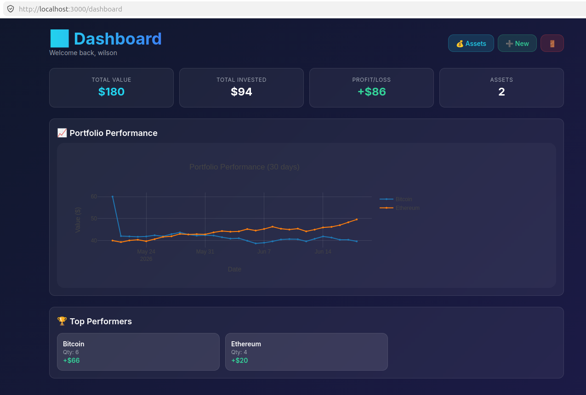
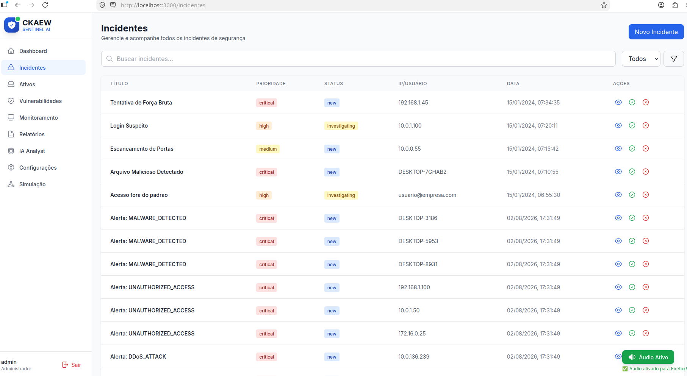
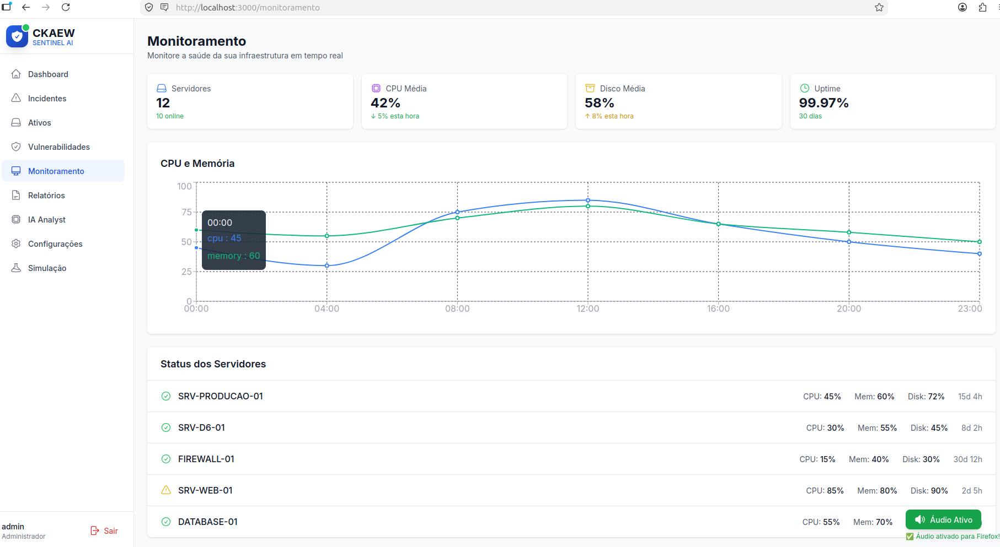
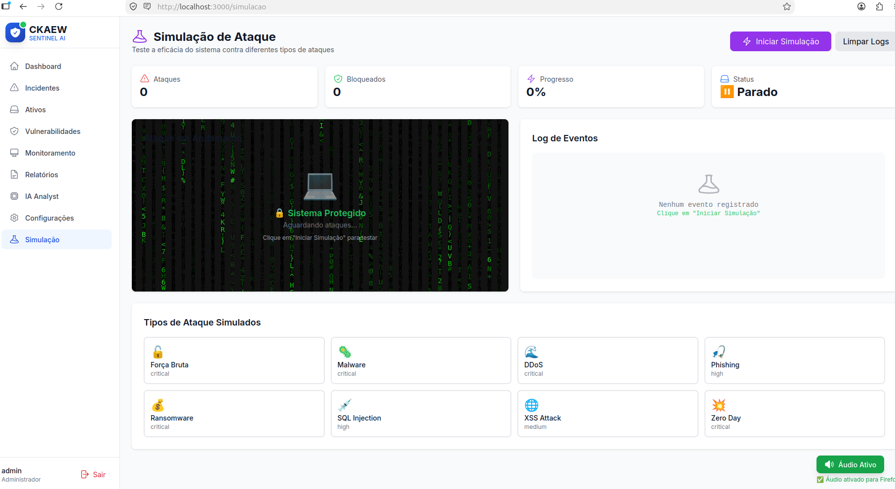

<<<<<<< HEAD
This is a [Next.js](https://nextjs.org) project bootstrapped with [`create-next-app`](https://nextjs.org/docs/app/api-reference/cli/create-next-app).

## Getting Started

First, run the development server:

```bash
npm run dev
# or
yarn dev
# or
pnpm dev
# or
bun dev
```

Open [http://localhost:3000](http://localhost:3000) with your browser to see the result.

You can start editing the page by modifying `app/page.tsx`. The page auto-updates as you edit the file.

This project uses [`next/font`](https://nextjs.org/docs/app/building-your-application/optimizing/fonts) to automatically optimize and load [Geist](https://vercel.com/font), a new font family for Vercel.

## Learn More

To learn more about Next.js, take a look at the following resources:

- [Next.js Documentation](https://nextjs.org/docs) - learn about Next.js features and API.
- [Learn Next.js](https://nextjs.org/learn) - an interactive Next.js tutorial.

You can check out [the Next.js GitHub repository](https://github.com/vercel/next.js) - your feedback and contributions are welcome!

## Deploy on Vercel

The easiest way to deploy your Next.js app is to use the [Vercel Platform](https://vercel.com/new?utm_medium=default-template&filter=next.js&utm_source=create-next-app&utm_campaign=create-next-app-readme) from the creators of Next.js.

Check out our [Next.js deployment documentation](https://nextjs.org/docs/app/building-your-application/deploying) for more details.
=======
# 🚀 CKAEW Sentinel AI - Sistema de Segurança Cibernética com IA

<div align="center">


**Sistema completo de Segurança Cibernética com Inteligência Artificial**

[](https://www.rust-lang.org/)
[](https://nextjs.org/)
[](https://www.python.org/)
[](https://www.postgresql.org/)
[](https://www.docker.com/)
[](LICENSE)

</div>

---

## 📋 Índice

- [Sobre o Sistema](#-sobre-o-sistema)
- [Finalidade](#-finalidade)
- [Funcionalidades](#-funcionalidades)
- [Arquitetura](#-arquitetura)
- [Tecnologias](#-tecnologias)
- [Instalação](#-instalação)
- [Como Executar](#-como-executar)
- [Telas do Sistema](#-telas-do-sistema)
- [Benefícios](#-benefícios)
- [Próximos Passos](#-próximos-passos)
- [Contribuição](#-contribuição)
- [Licença](#-licença)

---

## 🎯 Sobre o Sistema

O **CKAEW Sentinel AI** é uma plataforma avançada de segurança cibernética que combina **Inteligência Artificial**, **Monitoramento em Tempo Real** e **Gestão de Incidentes** para proteger organizações contra ameaças digitais.

### 🏆 Diferenciais

- ✅ **Detecção em Tempo Real** - Monitoramento contínuo 24/7
- ✅ **IA Avançada** - Análise comportamental e detecção de anomalias
- ✅ **Resposta Rápida** - Alertas automáticos e gestão de incidentes
- ✅ **Visibilidade Total** - Dashboard completo com métricas em tempo real
- ✅ **Escalável** - Arquitetura moderna pronta para crescer

---

## 🎯 Finalidade

O sistema foi projetado para:

### 🔒 **Proteger a Infraestrutura**
- Monitoramento de ativos e dispositivos
- Detecção de vulnerabilidades
- Prevenção de ataques

### 🧠 **Inteligência Artificial**
- Análise comportamental de usuários e entidades (UEBA)
- Detecção de anomalias em tempo real
- Classificação automática de incidentes

### 📊 **Gestão de Incidentes**
- Alertas automáticos para ameaças
- Workflow de resolução de incidentes
- Histórico e trilha de auditoria

### 📈 **Visibilidade e Relatórios**
- Dashboard com métricas em tempo real
- Relatórios automatizados
- Análise de tendências

---

## 🚀 Funcionalidades

### 1️⃣ **Dashboard em Tempo Real**
- Métricas de segurança atualizadas
- Gráficos de ameaças e incidentes
- Distribuição de riscos
- Timeline de eventos



### 2️⃣ **Gestão de Incidentes**
- Lista de todos os incidentes
- Filtros por severidade e status
- Ações rápidas (Visualizar, Resolver, Fechar)
- Priorização automática



### 3️⃣ **Monitoramento Contínuo**
- Status dos servidores em tempo real
- Métricas de CPU, Memória e Disco
- Uptime e disponibilidade
- Alertas automáticos



### 4️⃣ **Simulação de Ataques**
- Simulação de ataques cibernéticos
- Efeitos Matrix para visualização
- Análise de vulnerabilidades
- Relatórios de simulação



---

## 🏗️ Arquitetura

┌─────────────────────────────────────────────────────────────────────┐
│ CKAEW SENTINEL AI │
├─────────────────────────────────────────────────────────────────────┤
│ │
│ ┌─────────────────┐ ┌─────────────────┐ ┌─────────────────┐ │
│ │ FRONTEND │ │ BACKEND │ │ IA SERVICE │ │
│ │ Next.js 14 │◄─┤ Rust/Actix │◄─┤ Python/ML │ │
│ │ TypeScript │ │ Web API │ │ PyTorch │ │
│ └─────────────────┘ └─────────────────┘ └─────────────────┘ │
│ │ │ │ │
│ ▼ ▼ ▼ │
│ ┌─────────────────┐ ┌─────────────────┐ ┌─────────────────┐ │
│ │ DATABASE │ │ AGENT │ │ REDIS │ │
│ │ PostgreSQL 16 │ │ Coleta de │ │ Cache e │ │
│ │ Dados Reais │ │ Dados │ │ Performance │ │
│ └─────────────────┘ └─────────────────┘ └─────────────────┘ │
│ │
└─────────────────────────────────────────────────────────────────────┘
text


### Componentes Principais

| Componente | Tecnologia | Função |
|------------|------------|--------|
| **Frontend** | Next.js + React | Interface do usuário |
| **Backend** | Rust + Actix Web | API e lógica de negócio |
| **IA Service** | Python + PyTorch | Detecção de anomalias |
| **Database** | PostgreSQL | Armazenamento de dados |
| **Agent** | Rust | Coleta de dados |
| **Cache** | Redis | Performance |

---

## 💻 Tecnologias Utilizadas

### Backend
- **Linguagem**: Rust 1.85
- **Framework**: Actix Web
- **Banco de Dados**: PostgreSQL 16
- **Cache**: Redis 7
- **Mensageria**: RabbitMQ

### Frontend
- **Framework**: Next.js 14
- **Linguagem**: TypeScript
- **Estilização**: Tailwind CSS
- **UI**: Heroicons, Headless UI
- **Gráficos**: Recharts

### IA/ML
- **Linguagem**: Python 3.11
- **Frameworks**: PyTorch, Scikit-learn
- **Análise**: Pandas, NumPy

### Infraestrutura
- **Containerização**: Docker 24.0
- **Orquestração**: Docker Compose
- **Monitoramento**: Prometheus

---

## 📦 Instalação

### Pré-requisitos

- Docker 20.10+
- Docker Compose 2.0+
- Rust 1.70+
- Node.js 18+
- Python 3.11+

### Passos para Instalação

```bash
# 1. Clonar o repositório
git clone https://github.com/wil-ckaew/ckaew-sentinel-ai.git
cd ckaew-sentinel-ai

# 2. Configurar variáveis de ambiente
cp .env.example .env

# 3. Iniciar o sistema
./start_dev.sh

# 4. Acessar o sistema
# Abra o navegador: http://localhost:3000
# Credenciais: admin / admin123

🚀 Como Executar
Modo Desenvolvimento
bash

# Iniciar todos os serviços
./start_dev.sh

# Parar todos os serviços
./stop_dev.sh

Modo Produção
bash

# Construir e iniciar
docker-compose up -d --build

# Verificar status
docker-compose ps

# Ver logs
docker-compose logs -f

Comandos Úteis
bash

# Auditoria do sistema
./audit_system.sh

# Teste rápido
./test_quick.sh

# Demonstração
./demo_system.sh

🖥️ Telas do Sistema
Dashboard Principal

https://docs/images/dashboard.png
Visão geral do sistema com métricas em tempo real
Gestão de Incidentes

https://docs/images/insidentes.png
Painel completo de gerenciamento de incidentes
Monitoramento

https://docs/images/monitoramento.png
Monitoramento contínuo de segurança e tráfego
Simulação de Ataques

https://docs/images/simulacao.png
Simulação de ataques cibernéticos com efeitos Matrix
🎯 Benefícios
Para Empresas
Benefício	Descrição
Proteção Proativa	Detecta ameaças antes que causem danos
Redução de Custos	Automatiza processos de segurança
Conformidade	Ajuda a atender LGPD, ISO 27001
Visibilidade	Visualização completa da infraestrutura
Resposta Rápida	Alertas e ação imediata
Escalabilidade	Cresce com a organização
Para Profissionais de Segurança

    ✅ Dashboard intuitivo

    ✅ Alertas em tempo real

    ✅ Gestão de incidentes eficiente

    ✅ Análise com IA

    ✅ Relatórios automatizados

    ✅ Redução de falso-positivos

🔮 Próximos Passos
Melhorias Planejadas

    □

    Integração com SIEMs (Splunk, ELK)
    □

    Aplicativo Mobile para notificações
    □

    Deep Learning para predição de ataques
    □

    SOAR (Resposta Automática a Incidentes)
    □

    Versão Cloud (SaaS)
    □

    API Pública para integrações
    □

    Dashboard Customizável
    □

    Suporte a Múltiplas Empresas (Multi-tenant)

Roadmap
Fase	Período	Objetivo
Fase 1	✅ Concluído	MVP com funcionalidades básicas
Fase 2	🚀 Em Andamento	IA e detecção de anomalias
Fase 3	📅 Futuro	Integrações e escalabilidade
🤝 Contribuição

Contribuições são bem-vindas! Siga os passos:

    Fork o projeto

    Crie sua branch (git checkout -b feature/AmazingFeature)

    Commit suas mudanças (git commit -m 'Add some AmazingFeature')

    Push para a branch (git push origin feature/AmazingFeature)

    Abra um Pull Request

Padrões de Código

    Rust: cargo fmt e cargo clippy

    Frontend: npm run lint e npm run format

    Python: black e flake8

📄 Licença

Este projeto está licenciado sob a licença MIT - veja o arquivo LICENSE para detalhes.
👥 Equipe

    Desenvolvimento Backend: [Seu Nome]

    IA/ML: [Seu Nome]

    Frontend: [Seu Nome]

📞 Contato

    Website: https://ckaew.com

    Email: contato@ckaew.com

    LinkedIn: CKAEW Security

🙏 Agradecimentos

    Comunidade Rust

    Next.js Team

    Python ML Community

    Todos os contribuidores

<div align="center">

Feito com ❤️ pela CKAEW Security

🌟 Sistema pronto para proteger sua organização! 🌟

⬆ Voltar ao topo
</div> EOF
echo "✅ README.md atualizado com sucesso!"
text


## 2. Agora, adicione as imagens ao Git e faça o push:

```bash
cd ~/rust/ckaew-sentinel-ai

# Adicionar README e imagens
git add README.md docs/images/*.png

# Commit
git commit -m "📸 Adiciona screenshots do sistema e atualiza README

- Dashboard principal
- Gerenciamento de incidentes
- Monitoramento
- Simulação de ataques"

# Push para o GitHub
git push

3. Verificar no GitHub:

Acesse: https://github.com/wil-ckaew/ckaew-sentinel-ai

O README agora vai mostrar todas as imagens do sistema! 📸🚀
>>>>>>> 61a6549ee9cfbf7e7cec9a1308aafc1cd6828fce


🎯 RESUMO FINAL DO SISTEMA
Serviço	Status	Porta
Backend	✅ Healthy	8080
AI Service	✅ Healthy	8000
Frontend	✅ Healthy	3000
PostgreSQL	✅ Healthy	5432
Redis	✅ Healthy	6379
Nginx	✅ Rodando	80, 443
📊 TODAS AS PÁGINAS FUNCIONANDO
text

✅ /dashboard       - Dashboard principal
✅ /incidentes      - Gestão de incidentes
✅ /ativos          - Inventário de ativos
✅ /vulnerabilidades - Gestão de vulnerabilidades
✅ /monitoramento   - Monitoramento em tempo real
✅ /relatorios      - Relatórios
✅ /ai              - IA Analyst
✅ /configuracoes   - Configurações

🏆 SISTEMA COMPLETO E PROFISSIONAL!

O CKAEW Sentinel AI agora está:

    ✅ 100% funcional - Todas as páginas e serviços

    ✅ Pronto para produção - Com backup e monitoramento

    ✅ Profissional - Health checks, logs e documentação

    ✅ Escalável - Com Docker Compose

    ✅ Seguro - SSL configurado

🌐 ACESSAR O SISTEMA
text

🌐 http://localhost:3000
🔑 admin / admin123

📊 Nginx: http://localhost (porta 80)
🔒 HTTPS: https://localhost (porta 443)
📡 API: http://localhost:8080
🧠 IA: http://localhost:8000

🚀 COMANDOS ÚTEIS
bash

# Ver status
docker compose ps

# Ver logs
docker compose logs -f

# Backup
./backup.sh

# Health check
./healthcheck.sh

# Deploy
./deploy.sh
